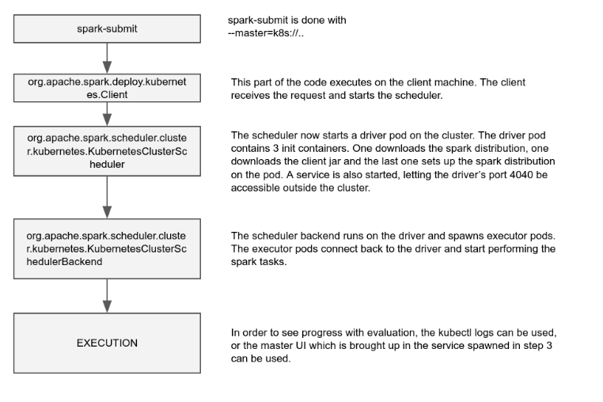

# Pre-requisites
* maven, JDK and all other pre-requisites for building Spark.
* An accessible kubernetes cluster which is running 1.4 or a 1.3.x cluster with alpha features enabled.
    * We use init-containers, which require the above.

# Steps to compile

* Clone the fork of spark: https://github.com/foxish/spark/ and switch to the k8s-support branch.
* Build the project
    * ./build/mvn -Pkubernetes -Phadoop-2.4 -Dhadoop.version=2.4.0 -DskipTests package
* Ensure that you are pointing to a k8s cluster (kubectl config current-context), which you want to use with spark.
* Set the appropriate environment variables:
    * `export SPARK_DISTRO_URI=http://storage.googleapis.com/foxish-spark-distro/spark.tgz`
    * This should be a runnable distribution of spark. 
    * The tgz specified above was build as follows:
       * ./dev/make-distribution.sh --name custom-spark --tgz -Pkubernetes -Phadoop-2.4
* `export SPARK_DRIVER_IMG=foxish/k8s-spark-driver`
   * This is the runnable docker image we will use. The docker image sources can be found here.
* [OPTIONAL] `export K8S_NAMESPACE=<name>`
   * This namespace needs to exist before hand. This env var can be left unset and it will use the default namespace.
* Launch a spark-submit job:
   * `./bin/spark-submit --deploy-mode cluster --class org.apache.spark.examples.SparkPi --master k8s://default --conf spark.executor.instances=5 http://storage.googleapis.com/foxish-spark-distro/original-spark-examples_2.11-2.1.0-SNAPSHOT.jar 10000`
   * The implementation is such that it is interactive, and will clean the drivers and executors up upon termination.
   * `--master k8s://default` ensures that it picks up the correct APIServer the default from the current context. 
* Check for pods being created. Watch the master logs using kubectl log -f <driver-pod>.
* If on a service that allows external load balancers to be provisioned, an external IP will be allocated to the service associated with the driver. The spark-master UI can be accessed from that IP address on port 4040.

